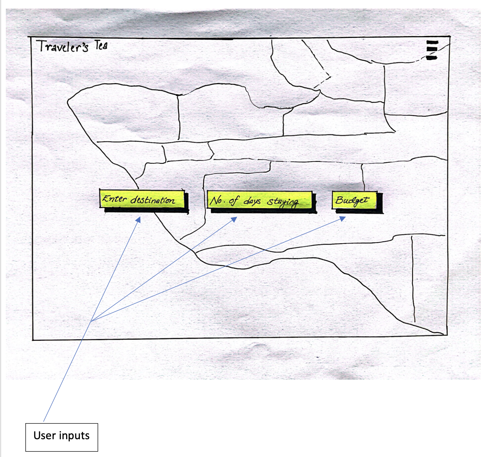
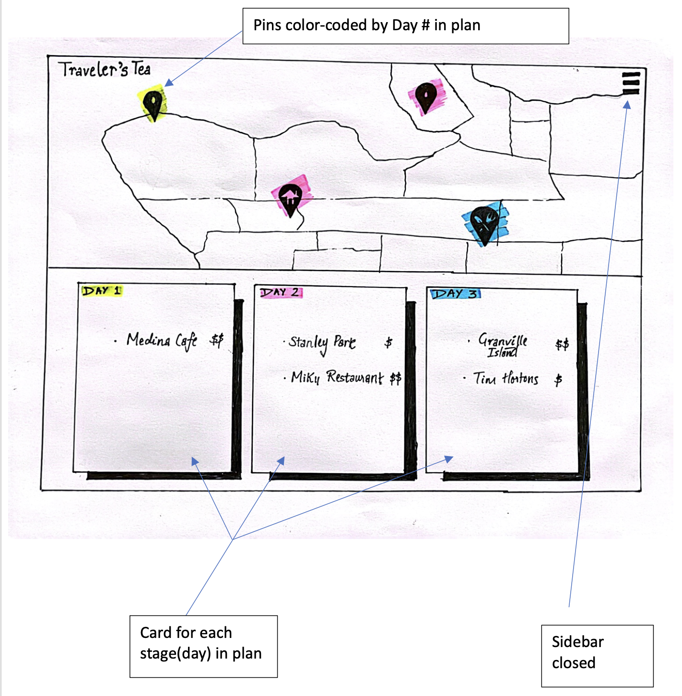
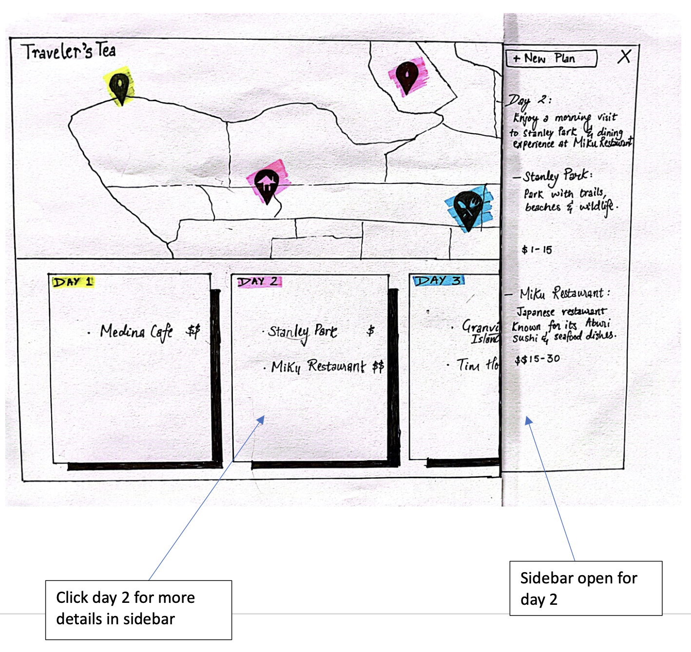

# TravelersTea

## Table of Contents

- [Project Description](#project-description)
- [Team Members](#team-members)
- [Project Requirements](#project-requirements)
  - [Minimal Requirements](#minimal-requirements)
  - [Standard Requirements](#standard-requirements)
  - [Stretch Requirements](#stretch-requirements)
- [Task Breakdown](#task-breakdown)
- [Prototypes](#prototypes)
- [Instructions](#instructions)

## Project Description

This project is for users who would like to create plans in some location X, and the app will serve as a personal
assistant. Our app will suggest an itinerary based on the user's preferences to make planning a trip less daunting and
less time-consuming. We will store information related to travel plans. A plan will consist of stageLocation (e.g. a
movie theater, a cute park), and information regarding that stageLocation (e.g. description, name, price, location etc).
Given this data, users will be able to have meaningful thought out trips. Additional functionalities include a social
aspect (e.g. sharing plans, rating plans).

## Team Members

- Lymeng Naret
- Noreen Chan
- Rithin Kumar
- Vaishnavi Sinha
- Andy Liang

## Project Requirements

#### Minimal Requirements

- Users should be able to input a set of preferences (Destination, Number of Days, Budget, Places per day), to generate
  personalized travel plans.
- Users can see destination markers on a map.
- Users can see a description of each destination.
- Users can create, read, update, and delete plan metadata.
- Users can manually update an individual destination within a plan.

#### Standard Requirements

- Display ratings of suggested places.
- Currency conversion for non-local plans.
- Users can regenerate specific locations of a plan’s destinations.
- Login system.
- Notes section (e.g. dietary restrictions, travel preferences).

#### Stretch Requirements

- Colloquial prompts (e.g. instead of “{ destination: ‘Vancouver’, budget: 300 }”, just input “I want to tour Vancouver
  and spend $300 max.”)
- Users can generate different plans based on the weather.
- Multi-language support.
- Entire application should be mobile-friendly
- Users can share plans on a global list.
- Users can vote on plans.
- Share itinerary as a link.
- DallE to generate Pin icons.

## Task Breakdown

#### Users should be able to input a set of preferences (Destination, Number of Days, Budget, Places per day), to generate personalized travel plans.

- Users will enter the following preferences for example in the form:
  - Number of days
  - Number of places per day
  - Budget
  - Destination city
- App will provide Expected Outputs:
  - Stage
  - Name of Place
  - Description
  - Location
  - Expense
- Design the frontend
  - Mockup for input form
  - Mockups for output of stages
- Design the backend routes

#### Users can create, read, update, and delete plan metadata

- Create: this creates the plan, along with the metadata fields `Name` and `Description`.
- Read: display the metadata in an UI
- Update: can update the plan’s metadata or destinations
- Delete: this deletes the entire plan

## Prototypes

#### Top-level plan: Homepage

User input



#### App Response: Plan Overview

With sidebar closed



With sidebar open: Specific details about a day in the plan



## Instructions

This is a MERN stack project using JavaScript, with auto-linting and formatting set up using ESLint and Prettier. We
use [Yarn Workspaces](https://classic.yarnpkg.com/lang/en/docs/workspaces/) to simplify installation and running
scripts.

#### Prerequisites

1. Install [Node.js](https://nodejs.org/en). This will include Yarn as well.
2. Install [MongoDB](https://www.mongodb.com/docs/manual/installation/).

#### Installation

1. Clone the repository:

```
git clone https://github.com/cpsc455-bugstorm/TravelersTea.git
```

2. Install the dependencies:

```
yarn install
```

Now, you will need `.env` files, one in server and one in client.

3. Create a new file `.env` in the `server` folder:

```
touch server/.env
```

4. Find the correct `<value>` for `ENV`, `MONGO_USERNAME`, and `MONGO_PASSWORD` in
   discord's [secret](https://discord.com/channels/1106050152587874364/1110797187463512116) channel.

The content of `.env` file should look like this (with the `<value>` replaced with the correct constant) :

```
ENV = <value>
MONGO_USERNAME = <value>
MONGO_PASSWORD = <value>
```

5. Create a new file `.env` in the `client` folder:

```
touch client/.env
```

6. Find the correct `<value>` for `REACT_APP_MAPBOX_TOKEN` in
   discord's [secret](https://discord.com/channels/1106050152587874364/1110797187463512116) channel.

The content of `.env` file should look like this (with the `<value>` replaced with the correct constant) :

```
REACT_APP_MAPBOX_TOKEN = <value>
REACT_APP_DEV_API_URL  = <value>
```

#### Running the Project

1. Start both the server and client using [concurrently](https://www.npmjs.com/package/concurrently)

```
yarn start
```

Alternatively, you can start either server or client using the commands below:

```
# starting only server
yarn start:server

# starting only client
yarn start:client
```

follow the `client` link here: http://localhost:3000

follow the `server` link here: http://localhost:5001/api/user

#### Auto-Linting and Formatting

```
# run linter
yarn lint:fix

# check for linting errors
yarn lint

# run formatter
yarn format

# check for formatting errors
yarn format:check
```

We use [Husky](https://typicode.github.io/husky/) to run pre-commit hooks
with [lint-staged](https://github.com/okonet/lint-staged) to run linters on git staged files. This ensures that our code
is formatted correctly when we commit our codes and when we open a pull-request on `main` branch.

#### Troubleshooting tips:

- Restart your IDE to fix tailwind autocomplete.
- Delete all node_modules and do `yarn install` in the root directory.

## Client

### Folder Structure

#### Under `client/src`

- `components`: where react elements go.
  - `common`: reusable components, such as `Button`, `Dropdown`, `Alert` etc.
- `reducers`: put redux reducers here.
- `App.js`: the top-level React app.
- `index.css`: imports tailwind. Try not to modify this.
- `store.js`: configures redux; link any new reducers here.

#### Under `client/public`

This is where assets (e.g. images) go, as well as the `index.html`.

#### tailwind.config.js

Configure tailwind and add custom tailwind keywords.

## Server

### How to see our databases and how to use your own database?

To see some particular database, whether it is the shared one, of your own, follow the steps below.

1. Log in to [Mongo Atlas](https://www.mongodb.com/atlas/database) (press Sign In on the top right)
2. Press `Database` -> `Browse Collection`
   

3. Here is our database! Our collections (think of SQL Tables), along with other helpful buttons, can be found here:
   

To use your own database. Navigate to `config.js` in the `server` folder.

1. Simply change the `DB_USER_FLAG` to your name in all capital letters.
   
